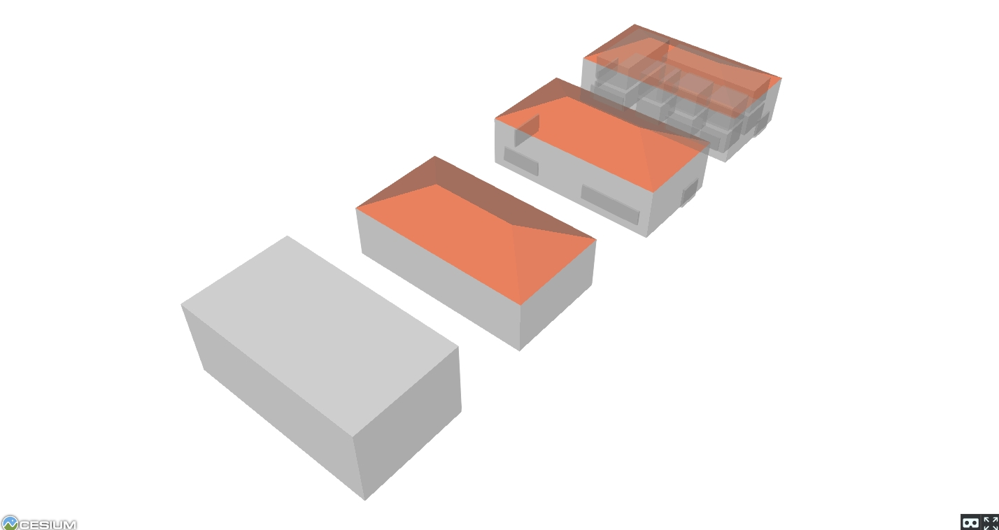
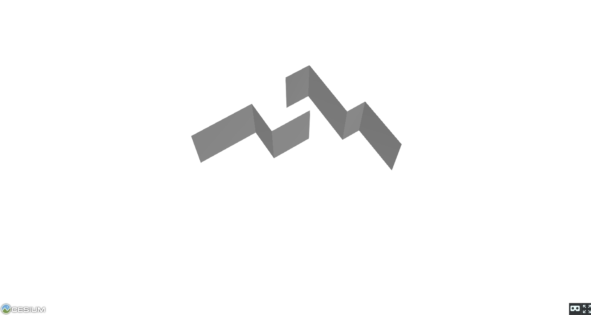
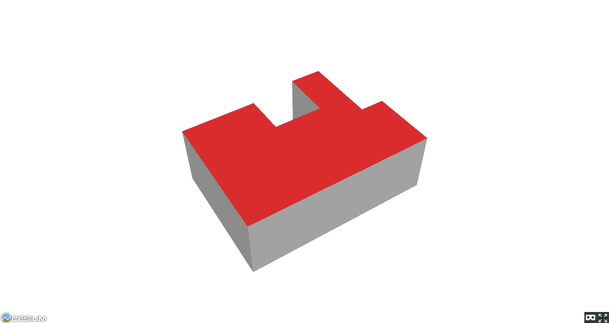

# 3D model viewer

Cesium based 3D model viewing demo in the browser (WebGL) hosted via gh-pages.

To run locally use the node server i.e.
    node server.js

		
## Demos

- Demo showing a simple set of 3D buildings illustrating CityGML LoD 1-4. Uses a placeholder "Tap to interact" by embedding the app in an iframe:

https://maptopixel.github.io/WebGL-model-demo/Apps/iframe_wrapper.html

- Demo showing dangers of extruding ESRI Shapefiles (which have a clockwise vertex ordering) for creating 2.5D / 3D buildings and then not checking the normal of resulting faces. "Wall" surface normals may face inward and not render correctly:

https://maptopixel.github.io/WebGL-model-demo/Apps/model_shapefile_ordering.html

- Demo showing reversed winding order for a Shapefile:

https://maptopixel.github.io/WebGL-model-demo/Apps/model_reversed_ordering.html

